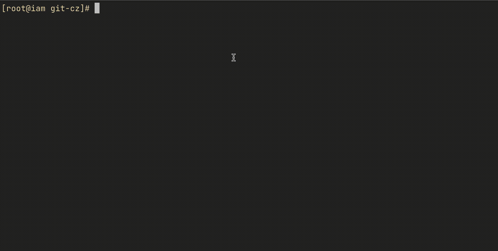

# What is it?

A great util to format you git commit message!

It's inspired by this gif:



# Usage?

## Build

You need to stay in project root first, and then:

```bash
unix> make 
unix> sudo mv git-cz $GOPATH/bin/
```
## And then

After `git add .`, all you need to do is:  

```bash
git cz
```

That's all.
